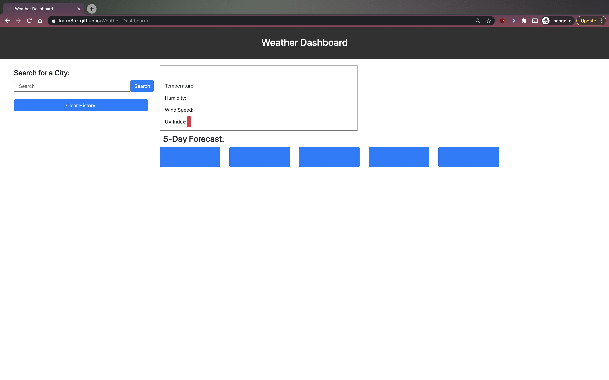
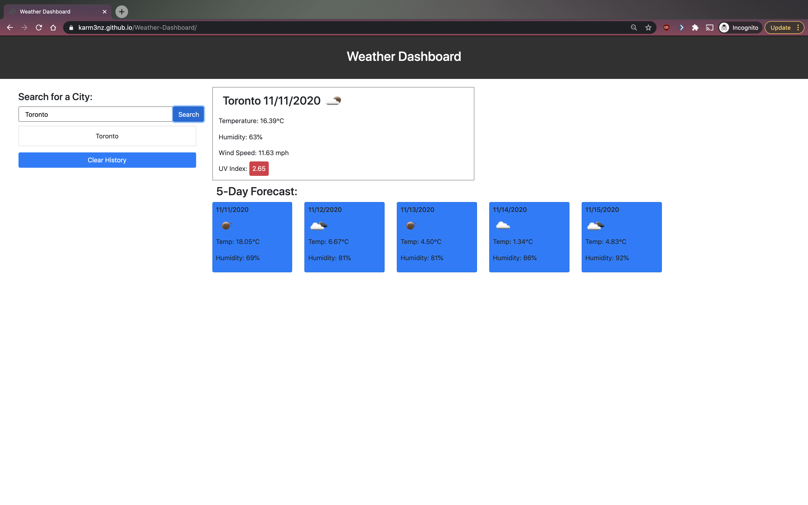
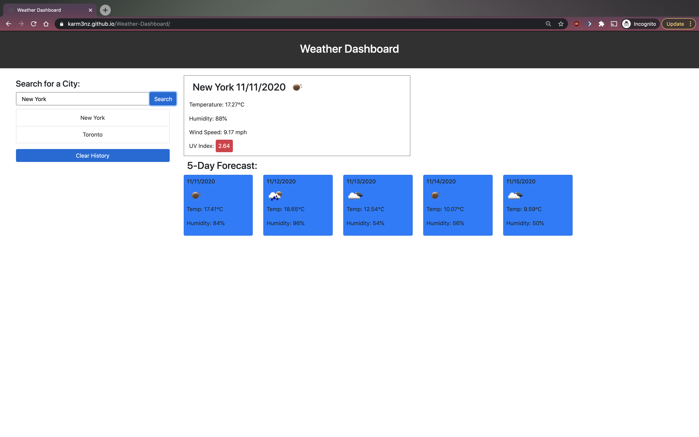

# Weather Dashboard

## Description 

From personal use, to business use, to educational use, a productive day starts with a plan. Part of planning your days, starts with planning for whatever weather comes our way for the week ahead, and that, starts with looking at the weather forecast! 

Features of the weather dashboard includes: searching weather forecast based on user's chosen city, displaying city's current weather data (temperature, humidity, windspeed, weather icon, UV index) front and centre of the page, weather forecast data for the following 5 days (weather icon, temperature, humidity), option to save user's city search to local storage, and clearing saved city searches.

In this project I had difficulties with adding the UV index to the project. After many trial errors and looking at other references, I finally got it working!

## Table of Contents

* [Installation](#installation)
* [Usage](#usage)
* [Credits](#credits)
* [License](#license)

## Installation

1) Make sure to have properly functioning computer.
2) Check if an internet browswer is installed. If so, go to step 4).
3) Install an internet browser of your choice. 
4) Open up internet web browser.
5) In the address bar, type in :  https://karm3nz.github.io/Weather-Dashboard/ and hit "enter" on the keyboard.

## Usage 

On display of the home page of the weather dashboard web application, the user can click the city search input bar to type in desired city to retreive weather forecast. Once the city is typed in, the user can proceed to click the search button.

From here the user will see current weather data as well as weather forecast of said city for the following 5 days. User from here can choose to search for other desired cities, come back to the page at a later time to see saved search, click on another saved city in the search history to view weather forecast, or clear search the city history.

## Credits

### Links to Tutorials/References Reffered to on Project:

References:
https://github.com/Cassquatch/Weather-Dashboard
https://github.com/dhens/Weather-Dashboard/blob/master/index.html
https://github.com/sahiljanbandhu/Weather-Dashboard

Open Weather API:
https://openweathermap.org/forecast5
https://openweathermap.org/api/uvi

Moment:
https://momentjs.com/

Bootstrap:
https://getbootstrap.com/docs/4.5/components/input-group/

## License

MIT License

Copyright (c) [2020] [Carmen Hui]

Permission is hereby granted, free of charge, to any person obtaining a copy
of this software and associated documentation files (the "Software"), to deal
in the Software without restriction, including without limitation the rights
to use, copy, modify, merge, publish, distribute, sublicense, and/or sell
copies of the Software, and to permit persons to whom the Software is
furnished to do so, subject to the following conditions:

The above copyright notice and this permission notice shall be included in all
copies or substantial portions of the Software.

THE SOFTWARE IS PROVIDED "AS IS", WITHOUT WARRANTY OF ANY KIND, EXPRESS OR
IMPLIED, INCLUDING BUT NOT LIMITED TO THE WARRANTIES OF MERCHANTABILITY,
FITNESS FOR A PARTICULAR PURPOSE AND NONINFRINGEMENT. IN NO EVENT SHALL THE
AUTHORS OR COPYRIGHT HOLDERS BE LIABLE FOR ANY CLAIM, DAMAGES OR OTHER
LIABILITY, WHETHER IN AN ACTION OF CONTRACT, TORT OR OTHERWISE, ARISING FROM,
OUT OF OR IN CONNECTION WITH THE SOFTWARE OR THE USE OR OTHER DEALINGS IN THE
SOFTWARE.